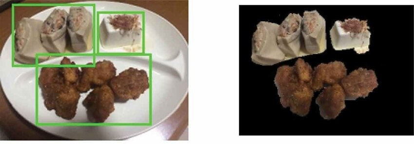

_`Full demonstration of specific lib`
=====================================

Brief overview: the library :code:`fcpp` integrates segmentation algorithms for natural images.

_`Theories or introduction`
---------------------------

Segmentation in :code:`fcpp` is an iterative image segmentation algorithm that separates foreground from background
using user input (e.g., a bounding box). It models color distributions of foreground and background with Gaussian
Mixture Models (GMMs), and formulates segmentation as an energy minimization problem on a graph. The algorithm
alternates between estimating pixel labels via graph cuts and refining the GMM parameters, converging to an optimal
segmentation.

.. math::
   :label: Energy function

   E(\mathbf{L}) = \sum_p D_p(l_p) + \lambda \sum_{p,q \in \mathcal{N}} w_{p,q} \cdot \delta(l_p \neq l_q)

The total energy is composed of the data term (pixel assignment cost) and the smoothness term (penalty for the
difference in labels of adjacent pixels). The unary term :math:`D_p(l_p) = -\log P(I_p | \Theta_{l_p})` describes
The negative log-likelihood of the color :math:`I_p` of pixel :math:`p` under the foreground or background GMM
model :math:`\Theta_{l_p}`, while :math:`w_{p, q}` is the edge weight between pixel :math:`p` and :math:`q`.

This part is optional.

_`Usage demonstration`
----------------------

The segmentation function segments the input image x by automatically defining a bounding box with margins
proportional to image size. It initializes foreground and background models, then runs inner grabCut with the
rectangle mode for 5 iterations. The output mask is refined to distinguish foreground (True) from background (False),
effectively extracting the main object while suppressing borders. Ideal for automated foreground extraction without
user input.

.. code-block:: cpp
   :caption: segmentation demo
   :name: segmentation demo

   #include <fcpp/seg.hpp>
   #include <fcpp/viz.hpp>

   int main() {
       cv::Mat img = cv::imread("input.jpg");  // read image
       auto mask = fcpp::get_foreground_mask(img);  // compute foreground object
       fcpp::imshow("Input vs. Segmented", img, mask);
       // downstream tasks...
       return 0;
   }

Further explanation for your code block.

_`Applying results`
-------------------

The following illustration takes pictures of doll, person, and chicken wing as input. The algorithm can automatically
calculate the their contours and areas (as shown in :numref:`Figure %s <images segmentation>`).

.. figure:: ../../images/OUT_demo1.jpg
   :name: images segmentation
   :width: 600
   :align: center

   Image segmentation illustration

With this segmentation algorithm, you can extract the main object with binding box in pictures. Like the
:numref:`Figure %s <food segmentations>` illustrated, the proper binding boxes can extract the
main food objects, which step is helpful for downstream analysis.

   Get foods from original figure

Or further combined with other image processing pipelines to obtain more complicated application such as background
blur (fill the real implementation of :code:`// downstream tasks` in :numref:`background blur`), showed
in :numref:`Figure %s <background blur>`.

.. figure:: ../../images/OUT_demo3.jpg
   :name: background blur
   :width: 500
   :align: center

   Background blur via segmentation algorithm

_`Algorithm benchmark from test frame`
--------------------------------------

The following table displays our testing matrix. As-checked platforms both in fields of **unit** and **stress**, are
ideal choices if necessary.

.. table:: test result among platforms
   :name: test results
   :align: center

   =============== ======= ============= ========== ============ =====
   architecture    OS      CPU           unit total stress total score
   =============== ======= ============= ========== ============ =====
   x86_64          Windows Core-i7 13gen 14822ms    173297ms     A
   x86_64          Linux   AMD Ryzen 7   13823ms    154512ms     A+
   arm             Linux   cortex-m3     failed     failed       D
   arm             Linux   cortex-a53    25392ms    254129ms     B
   arm             Linux   cortex-a53(4) 20365ms    233820ms     B+
   arm             Linux   cortex-a76(4) 16928ms    198923ms     A
   ...             ...     ...           ...        ...          ...
   risc-v          Linux   SiFive U74    35329ms    735723ms     C
   risc-v          Linux   Allwinner D1  38234ms    825231ms     C-
   =============== ======= ============= ========== ============ =====

The platforms with B+ or greater scores in :numref:`Table %s <test results>` are suggested to run this algorithms.